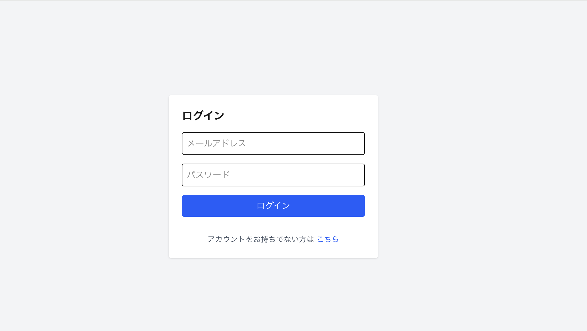
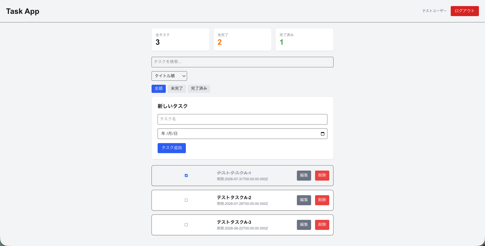
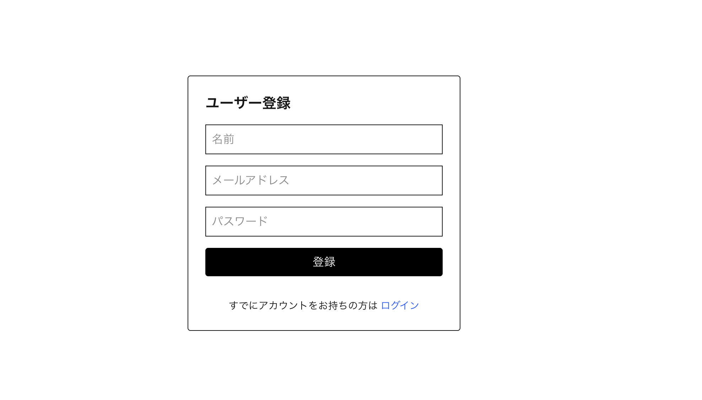

# Task Management App

Next.js / TypeScript / Prisma / Supabase PostgreSQL を使用して開発した、認証機能付きのタスク管理アプリケーションです。

ログインユーザーごとにタスクを管理でき、タスクの作成・編集・削除に加えて、検索・フィルター機能を実装しています。

## Demo

https://task-app-ashen-pi.vercel.app/login

## Screenshots

### ログイン画面



### タスク管理画面



### ユーザー登録画面



## Features

* ユーザー登録
* メールアドレス・パスワードによるログイン
* ログアウト
* ログインユーザーごとのタスク管理
* タスクの作成・編集・削除
* タスクの完了・未完了管理
* タスク検索
* タスクフィルター
* Loading状態の表示
* Error処理
* Toast通知
* 未ログインユーザーのアクセス制御
* ユーザーごとのデータアクセス制御

## Tech Stack

### Frontend

* Next.js 16
* React 19
* TypeScript
* Tailwind CSS

### Backend / Database

* Next.js App Router
* Prisma ORM
* PostgreSQL
* Supabase

### Authentication

* NextAuth.js v5
* Credentials Provider
* bcrypt

### Development

* VS Code
* Git / GitHub

## Architecture

```text
Browser
   │
   ▼
Next.js App Router
   │
   ├── Authentication
   │      └── NextAuth.js
   │
   ├── Task API
   │      └── Prisma ORM
   │
   ▼
Supabase
   └── PostgreSQL
```

## Authentication Flow

```text
User Registration
       │
       ▼
Password Hashing
       │
       ▼
Supabase PostgreSQL
       │
       ▼
NextAuth.js Credentials
       │
       ▼
Session
       │
       ▼
User-specific Task Management
```

## Authorization

タスクデータはログインユーザー単位で管理しています。

ログインユーザーのSessionからユーザーIDを取得し、Taskの`userId`と照合することで、他ユーザーのタスクにアクセスできないようにしています。

```text
User A
 ├── Task A-1
 └── Task A-2

User B
 ├── Task B-1
 └── Task B-2
```

User Aがログインしている場合、User Bのタスクは取得・更新・削除できません。

また、未ログインユーザーがTask管理画面へアクセスした場合は、ログイン画面へリダイレクトします。

## Database Schema

```text
User
 ├── id
 ├── name
 ├── email
 ├── password
 └── createdAt

Task
 ├── id
 ├── title
 ├── dueDate
 ├── completed
 ├── userId
 └── createdAt
```

UserとTaskは1対多のリレーションを持っています。

```text
User 1 ─────── N Task
```

ユーザーが削除された場合、そのユーザーに紐づくTaskも削除されるようにしています。

## Key Points

### 1. Prisma + Supabase PostgreSQL

SQLiteでのローカル開発からSupabase PostgreSQLへ移行し、Prisma ORMを利用してデータベースを操作しています。

### 2. Authentication

NextAuth.js v5のCredentials Providerを使用し、メールアドレスとパスワードによる認証を実装しています。

パスワードはbcryptを使用してハッシュ化して保存しています。

### 3. Authorization

認証済みかどうかだけでなく、ログインユーザー自身が所有するTaskのみ操作できるようにしています。

GET、POST、PATCH、DELETEそれぞれでユーザー単位のアクセス制御を行っています。

### 4. User Experience

ユーザー操作に対してLoading状態やError処理を実装し、Toast通知によって処理結果を分かりやすく表示しています。

また、検索・フィルター機能を実装することで、タスク数が増えた場合でも目的のタスクを見つけやすくしています。

## Project Structure

```text
app/
├── api/
│   ├── auth/
│   │   └── [...nextauth]/
│   ├── register/
│   │   └── route.ts
│   └── tasks/
│   		├──[id]/
│   		│ 	└── route.ts
│       └── route.ts
│
├── login/
├── register/
├── layout.tsx
├── page.tsx
├── providers.tsx
│
├── components/
│   └── Dashboard.tsx
│   └── EditTaskModal.tsx
│   └── Header.tsx
│   └── SessionProvider.tsx
│   └── TaskCard.tsx
│   └── TaskForm.tsx
│   └── TaskList.tsx
│   └── TaskSkeleton.tsx
│
lib/
└── prisma.ts

prisma/
└── schema.prisma

auth-client.ts
auth.ts
auth.config.ts

## Getting Started

### 1. Clone repository

```bash
git clone <your-repository-url>
cd task-app
```

### 2. Install dependencies

```bash
npm install
```

### 3. Environment Variables

`.env`を作成し、以下の環境変数を設定します。

```env
DATABASE_URL="your-supabase-database-url"
AUTH_SECRET="your-auth-secret"
```

### 4. Generate Prisma Client

```bash
npx prisma generate
```

### 5. Start development server

```bash
npm run dev
```

ブラウザで以下にアクセスします。

```text
http://localhost:3000
```

## Future Improvements

今後の改善予定：

* UI / UXのさらなる改善
* タスクの優先度機能
* ページネーション
* 自動テストの追加
* CI/CD環境の構築

## Author

Yusuke Ogura

---

## License

This project is for portfolio purposes.
